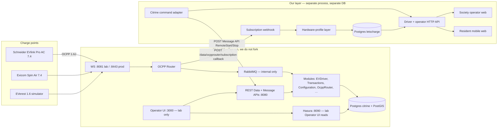
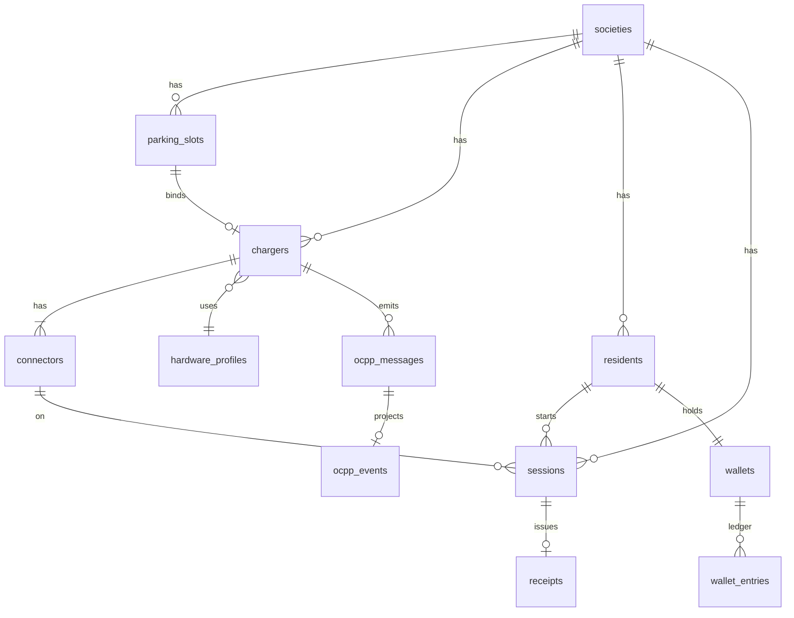
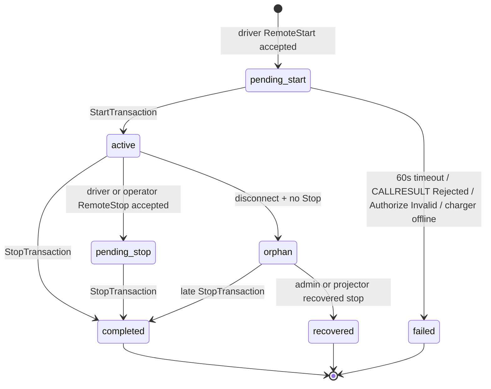

# v1 Design Contract — Apartment EV Charging CMS + Apps

| Field | Value |
|---|---|
| **Title** | Apartment EV charging — v1 design contract |
| **Author** | TBD (lets-charge) |
| **Date** | 2026-08-16 |
| **Status** | Draft — product defaults locked 2026-08-16 |
| **Scope contract** | [`README.md`](../README.md) (locked product scope — do not re-litigate) |
| **Repo** | [github.com/krishnamadhavan/lets-charge](https://github.com/krishnamadhavan/lets-charge) |

This document is the **v1 design contract**. An engineer should be able to implement from it after week-1 CitrineOS + EVerest bring-up. Product scope in the README is locked. CitrineOS week-1 facts (Open Questions 5–13) remain open. The our-layer stack (K12) stays **provisional** until `pnpm citrine --everest16` works.

---

## Overview

We sell software — an OCPP 1.6 JSON Charge Station Management System plus a society operator web and resident clients — for **one apartment / housing society** in India. We do not manufacture, install, or certify hardware. Two AC wallbox SKUs (Schneider Electric EVlink Pro AC 7.4 kW 1-phase Type 2, Exicom Spin Air 7.4 kW Type 2) talk to us over OCPP 1.6J. The protocol engine is **[CitrineOS](https://github.com/citrineos/citrineos-core)** (LF Energy, Apache 2.0). We run it; we do not fork it into our apartment app.

Our layer owns the society / slot / resident / session product model, a per-SKU hardware-profile compatibility layer, the society operator CMS, and the driver API (mobile web first, then Android, then iOS). Apps never talk to the box. CitrineOS is the source of truth for charger connection and raw protocol. A session is not billable unless start and stop (or a recovered stop) both exist. Payments in v1 are a prepaid test-balance stub. Site-level amp cap exists as a column; the load-management algorithm does not ship.

---

## Background & Motivation

Industry default is to split the box from the brain. OCPP is charger ↔ our cloud. We are CSMS + apartment product for one society (optionally CPO for that site). Building a minimal in-house CSMS from the spec is a 12-month / €500k–1M exercise; that is why the engine is CitrineOS, not a from-scratch protocol stack.

“OCPP-compliant” is not plug-and-play. Vendors differ on when they send `StatusNotification`, when `StartTransaction` fires, and how meter timestamps look. Real failures are ghost sessions (energy, no bill), chargers reverting to max amps when the net drops, and firmware that slightly changes JSON and billing dies. Mature CSMS keep a **per-vendor hardware profile**. That is why v1 certifies two dialects (Schneider = clean/global, Exicom = India volume) rather than claiming “any OCPP charger.”

This repo is greenfield. The only committed product artifacts are the README scope contract, and `.grok/rules`. There is no application source. This contract exists so week-1 bring-up and subsequent PRs have a single ownership, data-model, and API target.

India constraints we keep in mind and do **not** implement in v1: charging is de-licensed (DISCOM / inspector / fire NOC / BIS are site problems); MoP 2024 pushes OCPP and OCPI but field boxes are still mostly 1.6; charging is a service (GST ~18%), not electricity; UPI is table-stakes later. v1 is car AC in a society basement or podium, not Bharat AC-001 scooters and not a public highway network.

---

## Goals & Non-Goals

### Goals (v1)

- One society, a handful of AC wallboxes, working charge from plug-in to kWh on a receipt.
- OCPP 1.6 JSON only, through CitrineOS: boot, heartbeat, status, remote start/stop, meter values, session with kWh.
- Explicit supported-hardware list of **two certified SKUs** (plus a named fallback). A SKU is not certified until all four buy-rules hold.
- Raw OCPP message store **and** a normalized projection, so vendor dialects can be replayed.
- Charger identity = `vendor + model + serial`. Firmware is a mutable attribute used to select the hardware profile; a firmware bump is not a new charger.
- Society operator web: charger list, online/offline, last heartbeat/status/error, start/stop, session list. One admin. No roles.
- Resident mobile web: sign in, identify charger in front of me, start/stop + live kWh, receipt. Same driver API later serves Android, then iOS.
- Prepaid test-balance stub. Site-level amp cap column. Hardware-profile layer for Schneider vs Exicom.

### Non-goals (explicitly out of v1)

- Native iOS and Android in parallel on day one.
- Public maps, reservations, subscriptions, OCPI / roaming / other CPO networks.
- UPI, GST invoices, real wallets. (Stub payment until sessions are reliable.)
- Dynamic load-management **algorithm** (column now, logic later).
- OCPP 2.0.1, Plug & Charge, ISO 15118. Data model must not block 2.0.1 later.
- White-label, multi-society tenancy, “support every Indian OEM.”
- Hardware manufacturing, ARAI/BIS, installation contracting.
- Forking CitrineOS into this repo or rewriting their Operator UI into the apartment product.
- Centring Incredible Engineering in the product, hardware list, or partnership story.

### Buy-rules (a SKU is not “certified” until all four)

1. Custom CSMS WebSocket URL without a vendor ticket.
2. OCPP 1.6 JSON, not SOAP.
3. Exact firmware version known on the unit we test.
4. RemoteStart / RemoteStop **and** RFID work pointed at *our* backend, not only their vendor cloud.

Reject: DC, 22 kW 3-phase as first SKU, anything that says “OCPP can be enabled,” home-only boxes locked to the vendor app.

---

## Key Decisions

These are the architectural choices this contract makes. K12 (our stack) stays **provisional** until week-1 bring-up.

| # | Decision | Choice | Rationale |
|---|---|---|---|
| K1 | Engine vs product | Run CitrineOS as an unmodified service. Our app is a separate process + DB. | Locked. Forking couples us to their release train and puts vendor `if`s in the wrong repo. |
| K2 | Integration surface | **In:** Subscriptions webhook + REST Message API (commands) + **Authorization Data API** (idTag upsert/block only) + generated OpenAPI. **Out:** RabbitMQ, Sequelize writes to their tables, exposing Hasura to browsers. Webhook auth is a **query secret + Docker network**, not a custom header. | Subscriptions are the documented 3rd-party event API. Message API does not insert idTags; Authorize against CitrineOS needs a Data API row. Stock CitrineOS `webhook.dispatcher.ts` will not send `X-LC-Citrine-Secret`. |
| K3 | Identity split | CitrineOS `stationId` / `ocppConnectionName` is the wire name. Our charger identity is **`vendor + model + serial`**. `firmware` is mutable and nullable until first Boot. Profile is selected from vendor+model+firmware family. | Boxes change CSMS URL / station id; serial does not. Dialects are firmware-specific — that is a **profile-selection** reason, not a primary-key reason. Putting firmware in the unique key orphans the QR sticker on a firmware bump. |
| K4 | Session vs transaction | CitrineOS `Transaction` is protocol. Our `Session` is product. We project; we do not bill CitrineOS rows. | A session is billable only with start **and** stop (or recovered stop). Their transaction lifecycle is not our billing lifecycle. |
| K5 | Vendor quirks | Hardware-profile documents in **our** layer. No `if (vendor)` in CitrineOS. | Two certified dialects is the compatibility product. Profiles are data, not engine patches. |
| K6 | Society billing | **`prepaid_wallet` stub.** Decided 2026-08-16. v1 implements this. No UPI, no GST. | Other enum values (`monthly_maintenance`, `per_kwh_flat`) may remain in the schema for later. Wallet ledger can later accept a UPI top-up rail. |
| K7 | Charger-in-front-of-me | Printed **QR → short code**, typed short code / slot label as fallback. | Basement/podium: no GPS, no map. Resident is standing at the box. |
| K8 | Live kWh | **HTTP poll** `GET /v1/sessions/{id}` every 3s on the live screen. | Mobile web first. MeterValues from the box are 10–60s. Subscriptions are server-to-server; we persist then poll. SSE can be added later on the same resource. |
| K9 | Auth (one society) | Resident: phone + OTP stub. Operator: single shared admin secret. Session cookie. | Good enough for one society + test balance. Not OAuth, not multi-tenant SSO. |
| K10 | Repo layout | **Compose dependency + sibling `citrineos-core` clone.** Decided 2026-08-16. Not a submodule. Not compose-image-only. | We pin a CitrineOS image/tag and keep their source next door for `pnpm citrine --everest16` and OpenAPI dumps. |
| K11 | Hosting v1 | **We operate** CitrineOS + our layer for the first society. Decided 2026-08-16. | First customer should not run RabbitMQ/Hasura/Postgres. Adapter stays URL-configurable if they later self-host. |
| K12 | Our stack | TypeScript / **Node 22+** / Fastify / Postgres / Drizzle / React+Vite. **Provisional** until `pnpm citrine --everest16` works. Sibling `citrineos-core` requires **Node 24.16.0+**. | Same language as CitrineOS. Our layer may stay on 22. Running their launcher from source needs 24. Not pinned. |
| K13 | DB isolation | Separate Postgres **instance** on host port **5433**, database `letscharge`. Not the `citrine` database and not a schema on `ocpp-db`. | Avoids colliding with CitrineOS host `5432`. Survives their migrations. We can wipe/replay our projection. |
| K14 | Production WS | Lab: CitrineOS `:8081` (allow-unknown, no auth). First society: TLS WS (`:8443`/`:8444`) or basic-auth `:8082`, stations **pre-registered**. `:8083` is commented out in current compose (seeded mock eMSP) — do not publish it. | Their own README: `allowUnknownChargingStations` is test-only. Do not put 8081 on the internet. |
| K15 | UI order | Engine loop on a **real box** before operator web (week 5) and resident web (week 6). PR 9 and PR 11 **merge-gated** on a real-SKU billable-shape session in bring-up notes. | Locked week plan. EVerest-only UI stays the CitrineOS lab Operator UI. |
| K16 | OCPP idTag | Every resident has `ocpp_id_tag` (unique, ≤20, printable ASCII). Admin uses `ADMIN`. One lab RFID tag `RFIDTEST01`. All three are upserted into CitrineOS Authorization via Data API. | OCPP 1.6 `idTag` is `CiString20Type`. `RES-{uuid}` will fail validation. AuthorizeRemoteTxRequests needs a CitrineOS Authorization row. |
| K17 | Host ports (lab) | CitrineOS keeps 3000 / 5432 / 8080–8082 / 8443–8444 / 8090. **Our API = 3001**, **our web = 5173**, **our Postgres = 5433**. Vite proxies `/v1` and `/c` to the API (same-origin cookies). | Two composes on one VM otherwise collide. Society-Wi-Fi demo is HTTP; `Secure` cookies only when HTTPS / production. |
| K18 | SKU CSMS URL this month | **Planning assumption** (decided 2026-08-16): Schneider documented/likely; Exicom unproven until a unit is on the bench. Does **not** certify either SKU. Do not start a vendor call now. | Buy-rules still apply on the physical unit. `certified=false` until all four hold. |

---

## Proposed Design

### Architecture

```text
Schneider EVlink Pro AC 7.4  ─┐
Exicom Spin Air 7.4          ─┼─ OCPP 1.6J ─►  CitrineOS (engine)
EVerest simulator (week 1)   ─┘                    │
                                                   ├─ CitrineOS Operator UI  (lab only)
                                                   └─ our layer
                                                        ├─ society / slot / resident / session
                                                        ├─ hardware profiles
                                                        ├─ raw + normalized OCPP store
                                                        └─ driver API → mobile web → Android → iOS
```



Rules that do not move:

- CSMS is source of truth for charger state and energy. Apps never talk to the box.
- Every inbound OCPP message is stored raw **and** normalized.
- Supported hardware is an explicit list, not a marketing claim.

---

### 1. Ownership boundary: us vs CitrineOS

#### What CitrineOS owns

Verified from the [citrineos-core README](https://github.com/citrineos/citrineos-core), [apps/ocpp-server/README.md](https://github.com/citrineos/citrineos-core/blob/main/apps/ocpp-server/README.md), [docker-compose.yml](https://github.com/citrineos/citrineos-core/blob/main/docker-compose.yml), and [citrineos.github.io core-concepts](https://github.com/citrineos/citrineos.github.io).

| Concern | CitrineOS surface | Notes |
|---|---|---|
| OCPP 1.6 / 2.0.1 WebSocket | Server ports **8081** (no auth), **8082** (HTTP basic), **8083**, **8443/8444** (TLS). HTTP **8080**. | Chargers connect here. Path is typically `ws(s)://host:port/<stationId>`. |
| Protocol routing | OCPP Router + modules over **RabbitMQ** | RabbitMQ is **inter-module**, not a public integration bus. |
| Persistence | **PostgreSQL + PostGIS**, DB name `citrine`, user `citrine` | Sequelize migrations. Hasura tracks the same DB. |
| File/assets | MinIO locally (S3/GCS in supported envs) | Not used by our v1 product path. |
| Lab operator UI | Next.js + Refine on **:3000** | Reads via **Hasura :8090**. Commands via REST Data + Message APIs. **Lab only.** |
| Generated API docs | `http://localhost:8080/docs` (OpenAPI v3) | This is the command-path contract we pin after week-1. |
| EVerest harness | `pnpm citrine --everest16` | Week-1 fake wallbox. EVerest UI `:1880/ui/`. |
| OCPI server | `:8085`, compose profile `ocpi` | Ignore in v1. |

Logical modules present in `packages/core/src/modules/` (public tree, 2026-08): **Certificates, Configuration, EVDriver, Monitoring, OcppRouter, Reporting, SmartCharging, Tenant, Transactions**.

CitrineOS **Tenant** is *their* CSMS multi-tenancy primitive (`tenantId` on almost every call, default `DEFAULT_TENANT_ID`). It is **not** our apartment resident. We never name our resident entity `Tenant` in code.

#### What we own

| Concern | Ours | Must not live in CitrineOS |
|---|---|---|
| Society, parking slot, flat, resident | Product schema | Do not overload CitrineOS Location / Tenant |
| Charger binding to slot; identity `vendor+model+serial` (firmware selects profile) | `chargers` + `connectors` | CitrineOS station row is the wire name only |
| Hardware profile per certified SKU | YAML/JSON in `packages/hardware` | No vendor `if` in their router |
| Raw OCPP store + normalized projection | `ocpp_messages`, `ocpp_events` | Their logs are operational, not our replay store |
| Product session + billable flag + receipt | `sessions`, `receipts` | Do not bill their `Transaction` rows |
| Prepaid test-balance ledger | `wallets`, `wallet_entries` | — |
| Site amp cap column | `societies.site_amp_cap_amps` | No algorithm, do not use their SmartCharging module in v1 |
| Society operator CMS | `apps/web` operator routes | Do not restyle their Operator UI |
| Driver API + resident mobile web | `apps/api` + `apps/web` | Apps never open a WS to the box |

#### How we talk to CitrineOS

Four surfaces. Paths that are generated stay env-pinned after week-1. Callback *shape* is cited from public source and still stored raw.

**A. Events — Subscriptions (verified, primary inbound path)**

Documented in [Viewing OCPP Logs](https://github.com/citrineos/citrineos.github.io/blob/main/docs/core-concepts/viewing-ocpp-logs.md). Register **one callback URL per station** — public `OcppRouter` loads subscriptions with `readAllByStationId` / per `ocppConnectionName`. There is no all-stations URL in `webhook.dispatcher.ts`.

Docs still show `"stationId": "CS01"`; source uses `ocppConnectionName`. **`tenantId` belongs on the querystring** (`TenantQuerySchema` / same as Message API). Public `postSubscription` reads `tenantId` from the query and then assigns `request.body.tenantId` — a body-only `tenantId` is not sufficient. Lab value is **`1`**. Which *station* field name the Data API accepts is a week-1 fact.

```bash
curl --request POST 'localhost:8080/data/ocpprouter/subscription?tenantId=1' \
  --header 'Content-Type: application/json' \
  --data '{
    "stationId": "CS01",
    "onConnect": true,
    "onClose": true,
    "onMessage": true,
    "sentMessage": true,
    "url": "http://letscharge-api:3001/internal/citrine/ocpp?secret=ENVIRONMENT_SECRET"
  }'
```

Stock CitrineOS `_subscriptionCallback` POSTs `Content-Type: application/json` only (OIDC bearer only if `oidcClient` is configured). **It will not send a custom secret header.** v1 auth is:

1. Secret in the **callback URL query** (`?secret=`), which CitrineOS will POST as registered.
2. Bind the route to the `citrineos` Docker network; do not publish `/internal/*` on the host.

Do **not** require `X-LC-Citrine-Secret` unless we also configure CitrineOS OIDC (out of v1).

**Expected callback body** (from public `webhook.dispatcher.ts`; confirm with one EVerest Boot — still store `raw jsonb` first):

```json
// connect / close
{ "ocppConnectionName": "CS01", "event": "connected" }

// message (inbound or sent)
{
  "ocppConnectionName": "CS01",
  "event": "message",
  "origin": "cs",
  "message": "[2,\"…\",\"BootNotification\",{…}]",
  "info": {
    "correlationId": "…",
    "origin": "cs",
    "timestamp": "…",
    "protocol": "ocpp1.6",
    "action": "BootNotification",
    "type": "CALL"
  }
}
```

**Delivery is at-most-once.** CitrineOS does a single `fetch` with no retry. A 401/5xx drops that Boot/Start/Meter/Stop. Ingest must:

- Return **200 after a durable append** (or after detecting a duplicate).
- Be **idempotent** on `(ocpp_station_id, correlation_id, action, direction)` when `correlation_id` is present.
- Project asynchronously *after* the 200.

**Lab backfill:** if a gap alert fires (our `last_seen` stale while CitrineOS Operator UI shows messages), dump their message table via Hasura / `OCPPMessage` (exact table name is a week-1 fact) into `ocpp_messages` and re-project. Not a prod path.

**B. Commands — REST Message API (verified handlers, path generated)**

[EVDriver 1.6 `MessageApi.ts`](https://github.com/citrineos/citrineos-core/blob/main/packages/core/src/modules/EVDriver/src/module/1.6/MessageApi.ts) exposes, via `@AsMessageEndpoint`:

| CallAction | Method | OCPP 1.6 body |
|---|---|---|
| `RemoteStartTransaction` | `remoteStartTransaction` | `RemoteStartTransactionRequest` (`idTag`, optional `connectorId`, optional `chargingProfile`) |
| `RemoteStopTransaction` | `remoteStopTransaction` | `RemoteStopTransactionRequest` (`transactionId` — **integer** on the wire) |
| `UnlockConnector` | `unlockConnector` | (operator recovery; not a driver v1 button) |
| `ClearCache` / `SendLocalList` / `GetLocalListVersion` | — | RFID / local list later; not driver v1 |

[`AbstractModuleApi`](https://github.com/citrineos/citrineos-core/blob/main/packages/base/src/interfaces/api/AbstractModuleApi.ts):

- Message routes are **POST**.
- Querystring **requires** `identifier` (station / `ocppConnectionName`) and **`tenantId`**. Optional `callbackUrl`.
- Lab **`tenantId=1`** (`DEFAULT_TENANT_ID` in public `defineConfig.ts`).
- Response is **`IMessageConfirmation[]`**. Parse as an array. `success` means the call was queued / sent / cache-waited — **not** `RemoteStartTransaction.conf`. Docker `maxCallLengthSeconds` is 20; do not block the driver HTTP request on charger Accept.
- Path is generated by `_toMessagePath(action, version)`. Public implementation is `/ocpp/${version-without-ocpp-prefix}${evdriver.endpointPrefix}/${camelCaseAction}`.

**Likely (unverified — pin from `:8080/docs` in week 1):**

```
POST /ocpp/1.6/evdriver/remoteStartTransaction?identifier=<station>&tenantId=1
POST /ocpp/1.6/evdriver/remoteStopTransaction?identifier=<station>&tenantId=1
```

Do not hard-code those strings in product code. After `pnpm citrine --everest16` dump OpenAPI and pin:

```
CITRINE_TENANT_ID=1
CITRINE_REMOTE_START_PATH
CITRINE_REMOTE_STOP_PATH
CITRINE_SUBSCRIPTION_PATH=/data/ocpprouter/subscription
CITRINE_AUTHORIZATION_PATH
CITRINE_STATION_COMMISSION_PATH
```

**C. Allowed Data API writes — Authorization + commission (not Sequelize)**

The Message API does **not** insert an idTag. OCPP 1.6 chargers with `AuthorizeRemoteTxRequests=true` send `Authorize.req`; CitrineOS EVDriver checks **its** Authorization store. Without a row, week-2 RemoteStart and buy-rule #4 RFID fail with `Invalid` / no `StartTransaction`. Same hole for `ADMIN`.

**CitrineOS Authorization adapter** (our `packages/citrine-client`). Allowed write: **Data API only**. Never Sequelize, never `INSERT` into `citrine`.

| Our event | CitrineOS write |
|---|---|
| Resident create / seed | Upsert Authorization for `residents.ocpp_id_tag`, status Accepted, `tenantId=1` |
| Resident disable | Set that Authorization to Blocked (or equivalent) |
| Admin seed | Upsert Authorization for idTag `ADMIN` |
| Lab RFID (buy-rule #4) | Upsert one test tag `RFIDTEST01`. No `rfid_tags` table in v1. |
| Charger insert | Commission the Charging Station (their Data API / documented create), then `POST` a subscription for that `ocpp_station_id` with the secret URL |

Exact Authorization and ChargingStation Data API paths are **not pinned here** (same treatment as RemoteStart). PR 2 records them from OpenAPI. PR 6 implements the adapter.

**D. Reads — Hasura / Data API (lab and fallback only)**

- Operator UI reads CitrineOS tables through Hasura GraphQL (`:8090` → same `citrine` DB).
- Data API examples that exist in public docs: `PUT /data/configuration/boot?stationId=…`, `POST /data/configuration/password`.
- Our **society CMS does not query Hasura from the browser.** If we read CitrineOS state (e.g. to reconcile online/offline), the API process does it server-side. Prefer our projection (fed by subscriptions) as the operator’s source of truth so we can replay and so Hasura is not a prod dependency.

**E. Surfaces we will not use**

| Surface | Why not |
|---|---|
| RabbitMQ `citrineos` exchange | Internal module bus. No public schema. Would break on their queue refactor (already happened once: per-station → per-container). |
| Writing CitrineOS Sequelize tables | Their migrations own that schema. Dual-write is how you get unbillable sessions. Authorization goes through Data API. |
| CitrineOS SmartCharging module | Amp cap is a column only in v1. |
| CitrineOS OCPI server | Out of v1. |
| CitrineOS Operator UI as the product | Lab for protocol debugging. Society manager sees *our* web. |
| Patching `citrineos-core` in-tree | If we need a fix, upstream a PR. Meanwhile work around in the hardware profile. |
| Custom webhook headers / OIDC | Stock dispatcher will not send them. Query secret + network is enough for v1. |

#### CitrineOS configuration we will actually set

From the ocpp-server README, not invented:

- Lab WS `:8081` has `allowUnknownChargingStations` **on** and no security. They warn: **do not use in production.** Auto-commission on 1.6 multi-EVSE is known-wrong; our SKUs are single-socket AC so lab auto-commission is acceptable. First-society still **pre-registers** every station via the Authorization/commission adapter.
- First-society: pre-create the Charging Station (their “commission”) so the box may connect to `:8082` (basic auth) or `:8443`/`:8444` (TLS). Password via documented `POST /data/configuration/password`.
- Current `docker.ts` puts `protocols: OCPP_VERSION_LIST` on **8081 / 8082 / 8443 / 8444**. There is **no dedicated 8092** in current compose. Connecting-a-charger.md still says default servers accept only `ocpp2.0.1`; older notes cite 1.6 on 8092 as of 1.7.2. **Which port + subprotocol `pnpm citrine --everest16` and each physical SKU actually use is a week-1/2 fact** (Open Question 8). Do not guess in code.
- `:8083` is **commented out** in current `docker-compose.yml` (freed for a seeded mock eMSP). Do not document or publish it.
- Sibling clone of `citrineos-core` needs **Node 24.16.0+**. Our layer may use Node 22+.

#### Hardware-profile layer (ours)

A profile is a versioned YAML document, one file per certified SKU + firmware family. The projector applies it when normalizing a message. The engine never sees it.

```yaml
# packages/hardware/profiles/schneider-evlink-pro-ac-7.4.yaml
id: schneider-evlink-pro-ac-7.4
vendor: Schneider Electric
model: EVlink Pro AC
rated_kw: 7.4
phases: 1
connector_type: IEC_62196_T2
ocpp: "1.6J"
known_firmware: []          # filled when we have a unit
connectors:
  - ocpp_connector_id: 1
    label: "Type 2"
plug_in:
  # filled from the week 2–3 capture, not guessed
  status_notification_on_plugin: null
  start_transaction_requires_authorize: null
meters:
  # OCPP 1.6 default measurand — not a capture guess. Intervals stay null until week 2–3.
  energy_measurand: Energy.Active.Import.Register
  energy_unit: Wh
  clock_aligned_interval_sec: null
  sample_interval_sec: null
dialect_notes: []
buy_rules:
  custom_csms_url: unknown    # planning: Schneider likely; Exicom unproven; not certified
  ocpp_16_json: documented    # third-party OCPP 1.6J claimed
  firmware_pinned: false
  remote_start_stop_and_rfid_on_our_url: false
```

Week 2–3 fills the Schneider file from a real capture. Week 4 fills Exicom. **The diff between the two files is the compatibility layer.** Do not encode that diff as conditionals in a router.

Public signals we already have (not certification):

- Schneider EVlink Pro AC: OCPP 1.6J, third-party backend documented; commissioning via eSetup; some integrators set the OCPP URL in the charger UI. **Planning (2026-08-16):** treat as documented/likely. Does **not** certify the SKU. No vendor call now.
- Exicom Spin Air datasheet lists 3rd-party CMS + OCPP 1.6J. **Planning (2026-08-16):** unproven until a unit is on the bench. Does **not** certify the SKU. No vendor call now.

Fallback SKU #1: **Delta AC Mini Plus 7.4 kW** — same profile slot as Schneider if Schneider is unobtainable in ones and twos.

---

### 2. Apartment data model

One society → parking slots → chargers bound to slots → residents bound to flats. Separate database `letscharge`. All money is integer **paise**. All energy in the store is integer **watt-hours**; APIs may present kWh to 3 decimal places.

CitrineOS 2.0.1 uses EVSE + connector; 1.6 is connector-only. We store `ocpp_connector_id` now and a nullable `ocpp_evse_id` so 2.0.1 later does not require a rewrite.



#### Tables (v1)

**`societies`**

| Column | Type | Notes |
|---|---|---|
| `id` | uuid pk | |
| `name` | text | |
| `timezone` | text | default `Asia/Kolkata` |
| `site_amp_cap_amps` | int null | **Column now. Unused in v1.** Building electrical headroom. |
| `billing_mode` | enum | **`prepaid_wallet`** (v1, decided). `monthly_maintenance` \| `per_kwh_flat` reserved, unused in v1 |
| `test_tariff_paise_per_kwh` | int | stub rate, e.g. 1000 = ₹10/kWh. Not a tax invoice. |
| `created_at` | timestamptz | |

v1 has exactly one row.

**`parking_slots`**

| Column | Type | Notes |
|---|---|---|
| `id` | uuid pk | |
| `society_id` | uuid fk | |
| `label` | text | e.g. `B-12`, `Podium-04`. Unique per society. |
| `kind` | enum | `assigned` \| `shared` |
| `created_at` | timestamptz | |

**`hardware_profiles`**

| Column | Type | Notes |
|---|---|---|
| `id` | text pk | slug, e.g. `schneider-evlink-pro-ac-7.4` |
| `vendor` | text | |
| `model` | text | |
| `rated_kw` | numeric | 7.4 |
| `document` | jsonb | the YAML above, as stored |
| `revision` | int | bump when dialect notes change |

Seeded from `packages/hardware/profiles/*.yaml`. Not edited in the CMS in v1.

**`chargers`**

| Column | Type | Notes |
|---|---|---|
| `id` | uuid pk | |
| `society_id` | uuid fk | |
| `slot_id` | uuid fk null | bound when installed |
| `vendor` | text | part of identity |
| `model` | text | part of identity |
| `serial` | text | part of identity |
| `firmware` | text null | **mutable.** Null until first `BootNotification`. Not in the unique key. |
| `ocpp_station_id` | text | CitrineOS `stationId` / `ocppConnectionName` |
| `hardware_profile_id` | text fk null | resolved from vendor+model+firmware family; null until Boot or seed |
| `short_code` | text | printed on QR, unique, e.g. `LC-B12` |
| `certified` | bool | true only when all four buy-rules are checked **on the firmware currently installed** |
| `last_seen_at` | timestamptz null | from Heartbeat / any inbound |
| `ws_connected` | bool | from subscription `connected` / `closed` |
| `last_status` | text null | last normalized connector status |
| `last_error` | text null | last vendor error / fault |
| `created_at` | timestamptz | |

Unique `(vendor, model, serial)`. Unique `ocpp_station_id`. Unique `short_code`.

Commissioning/seed may insert a charger with `firmware=null` and `certified=false` before the box boots. On Boot:

1. Write `firmware` from the payload (do not insert a new charger).
2. Resolve `hardware_profile_id` from vendor + model + firmware family (`known_firmware` list, or the SKU profile if the family has one file).
3. If firmware is unknown: keep the row, set `certified=false`, surface an operator warning. Do **not** change `short_code`, `slot_id`, or `ocpp_station_id`.

On charger insert (after the row exists): run the CitrineOS commission + subscription adapter (§1 C).

**`connectors`**

| Column | Type | Notes |
|---|---|---|
| `id` | uuid pk | |
| `charger_id` | uuid fk | |
| `ocpp_connector_id` | int | `1` on both v1 SKUs |
| `ocpp_evse_id` | int null | reserved for 2.0.1 |
| `label` | text | from profile |

Unique `(charger_id, ocpp_connector_id)`.

**`residents`**

| Column | Type | Notes |
|---|---|---|
| `id` | uuid pk | |
| `society_id` | uuid fk | |
| `flat_label` | text | e.g. `A-1203` |
| `display_name` | text | |
| `phone` | text | E.164; v1 login identifier |
| `ocpp_id_tag` | text | OCPP 1.6 `idTag`: unique, **≤ 20 chars**, printable ASCII. Generated at create/seed as `LC` + 10 Crockford chars (12 total). Used in every RemoteStart for this resident and in the CitrineOS Authorization upsert. |
| `status` | enum | `active` \| `invited` \| `disabled` |
| `created_at` | timestamptz | |

Unique `(society_id, phone)`. Unique `ocpp_id_tag`. Named **resident**, never `tenant`, to avoid colliding with CitrineOS Tenant.

On create/seed: generate `ocpp_id_tag` and upsert CitrineOS Authorization (Accepted). On `disabled`: block that Authorization. Never send `RES-{uuid}` or the phone number as `idTag` — both can exceed `CiString20Type`.

**`admin_users`**

One row in v1. `id`, `login` (env default `admin`), `password_hash`, `created_at`. No roles. The installer RemoteStart idTag is the literal `ADMIN` (4 chars, fits CiString20). Seed upserts CitrineOS Authorization for `ADMIN`.

**`sessions`**

| Column | Type | Notes |
|---|---|---|
| `id` | uuid pk | public id on receipts |
| `society_id` | uuid fk | |
| `charger_id` | uuid fk | |
| `connector_id` | uuid fk | |
| `resident_id` | uuid fk null | null if RFID-only and unmatched |
| `ocpp_transaction_id` | text null | Store as text. On RemoteStop, coerce with `Number()`; reject if not a safe integer (OCPP 1.6 `transactionId` is an integer). |
| `id_tag` | text | Exact `residents.ocpp_id_tag`, or `ADMIN`, or the RFID presented (≤20) |
| `status` | enum | see state machine |
| `started_at` | timestamptz null | from StartTransaction |
| `stopped_at` | timestamptz null | from StopTransaction or recovery |
| `start_meter_wh` | bigint null | |
| `stop_meter_wh` | bigint null | |
| `energy_wh` | bigint null | closed energy only — see formulas below |
| `last_meter_wh` | bigint null | latest MeterValues while open |
| `last_meter_at` | timestamptz null | |
| `stop_reason` | text null | OCPP reason, `recovered`, `timeout`, `rejected`, `authorize_invalid`, `meter_reset` |
| `billable` | bool | **true only if** start and stop (or recovered stop) both exist, `energy_wh` is set, stop ≥ start, **`resident_id` is not null**, and `id_tag ≠ 'ADMIN'` |
| `created_at` | timestamptz | |

**Concurrency (enforced in the database, not just the API):**

```sql
CREATE UNIQUE INDEX sessions_one_open_per_connector
  ON sessions (connector_id)
  WHERE status IN ('pending_start', 'pending_stop', 'active', 'orphan');

CREATE UNIQUE INDEX sessions_one_open_per_resident
  ON sessions (resident_id)
  WHERE resident_id IS NOT NULL
    AND status IN ('pending_start', 'pending_stop', 'active');
    -- orphan is intentionally omitted: a missing Stop must not block
    -- that resident from starting on another charger.
```

A second `pending_start` on the same connector (resident or admin) fails the **connector** unique index → API `409 session_exists`. Admin start occupies the connector; a resident cannot 201 a second row on that box.

`orphan` stays on the **connector** index only. After a missing `StopTransaction`, that connector stays occupied until recover-stop or a late `StopTransaction`. The resident **can** start on a different charger. There is no resident recover API in v1 — recover-stop is operator-only and is the only way to free that connector (besides a late Stop).

**Energy formulas**

```
live_energy_wh =
  last_meter_wh − start_meter_wh
  when both are non-null AND last_meter_wh ≥ start_meter_wh
  else null

energy_wh =          -- persisted on close only
  stop_meter_wh − start_meter_wh
  when both are non-null AND stop_meter_wh ≥ start_meter_wh
  else null

amount_paise = floor(energy_wh * test_tariff_paise_per_kwh / 1000)
-- 3250 Wh @ 1000 paise/kWh = 3250 paise
-- Do NOT write energy_wh/1000 * tariff (integer division drops the 250 Wh).
```

API `energy_kwh` is `live_energy_wh / 1000` while the session is open, and `energy_wh / 1000` once closed (3 decimal places). If `stop_meter_wh < start_meter_wh` (meter reset): set `energy_wh = null`, `billable = false`, `stop_reason = meter_reset` (or append it). **Do not bill. Do not invent kWh.**

**Session state machine**



`billable` is a stored flag recomputed on every transition:

```
billable ⇔ started_at ≠ null
        ∧ stopped_at ≠ null
        ∧ energy_wh ≠ null
        ∧ stop_meter_wh ≥ start_meter_wh
        ∧ status ∈ {completed, recovered}
        ∧ resident_id IS NOT NULL
        ∧ id_tag ≠ 'ADMIN'
```

Unmatched RFID (`resident_id` null, e.g. lab `RFIDTEST01`) and installer (`ADMIN`) sessions can close with kWh and appear on the operator list. They are **never** `billable`, never get a `receipts` row, and never post `session_settle` (no wallet). Ghost energy (MeterValues without a closed session) is **not** a receipt.

**`pending_start` failure rules**

| Trigger | `stop_reason` | When |
|---|---|---|
| CitrineOS HTTP / array `success=false` or unreachable | `rejected` / (no row if we fail before insert — see start sequence) | Before or just after insert |
| `RemoteStartTransaction.conf` status `Rejected` (subscription `event: message`) | `rejected` | Projector |
| `Authorize.conf` `idTagInfo.status` ∈ {`Invalid`,`Blocked`,`Expired`} for this session’s `id_tag` | `authorize_invalid` | Projector |
| `StartTransaction` with `idTagInfo` Invalid | `authorize_invalid` | Projector |
| Still `pending_start` after **60 seconds** | `timeout` | Periodic job |
| Charger `ws_connected` becomes false while `pending_start` | `timeout` | Projector |

The 60s clock starts when we persist `pending_start`. CitrineOS `maxCallLengthSeconds: 20` is *their* send wait; it is not our session timeout.

**Stop recovery (v1, manual + one automatic rule)**

- Automatic: if CitrineOS later emits a `StopTransaction` for the same `ocpp_transaction_id`, we close as `completed` even if we already marked `orphan`.
- Manual: operator “Recover stop” sets `stopped_at = now()`, `stop_meter_wh = last_meter_wh`, `stop_reason = recovered`, status `recovered`. Only if `last_meter_wh` exists. This frees the **connector** unique index. A receipt is issued only if the recovered session is billable (has a `resident_id`). Admin/RFID orphans close without a receipt.
- We do **not** invent energy.

**`ocpp_messages`** (raw store)

| Column | Type | Notes |
|---|---|---|
| `id` | bigserial | |
| `charger_id` | uuid fk null | null until we can bind `stationId` |
| `ocpp_station_id` | text | always, from envelope |
| `direction` | enum | `inbound` \| `outbound` |
| `action` | text | `BootNotification`, `Heartbeat`, … |
| `correlation_id` | text null | |
| `raw` | jsonb | **exact callback body, untouched** |
| `received_at` | timestamptz | our clock |
| `protocol` | text | `ocpp1.6` |

This table is append-only. It is the source for replay when a hardware profile changes.

**`ocpp_events`** (normalized projection)

| Column | Type | Notes |
|---|---|---|
| `id` | bigserial | |
| `message_id` | bigint fk | |
| `charger_id` | uuid fk null | |
| `hardware_profile_id` | text null | which profile interpreted it |
| `action` | text | |
| `connector_ocpp_id` | int null | |
| `ocpp_transaction_id` | text null | |
| `occurred_at` | timestamptz null | vendor timestamp if parseable, else `received_at` |
| `fields` | jsonb | action-specific: status, measurands, meterWh, errorCode, … |

Projector is deterministic: `(raw, profile_revision) → fields`. Re-running it after a profile edit must be possible.

**`wallets` / `wallet_entries`**

- One wallet per resident. `balance_paise` is a cached sum of entries (recomputable).
- Entry reasons: `topup_stub`, `session_hold`, `session_settle`, `session_release`, `admin_adjust`.
- v1 start: if `billing_mode = prepaid_wallet` and `balance_paise <= 0`, reject RemoteStart with `insufficient_balance`. No real authorization hold amount in v1 (hold = 0); we still write a zero-amount `session_hold` so the ledger path exists.
- On billable close (requires a resident): `session_settle` = `floor(energy_wh * test_tariff_paise_per_kwh / 1000)` against that resident’s wallet. Receipt `amount_paise` matches. Copy says **test — not a tax invoice**. Unmatched RFID / `ADMIN` never reach this line.
- Other `billing_mode` values: start is allowed, settle writes `amount_paise = 0` and `settlement = deferred`. The column is there so we do not pretend the society has no billing opinion.

**`receipts`**

| Column | Type | Notes |
|---|---|---|
| `id` | uuid pk | |
| `session_id` | uuid fk unique | |
| `resident_id` | uuid fk | |
| `energy_wh` | bigint | |
| `amount_paise` | int | 0 if deferred |
| `tariff_paise_per_kwh` | int | snapshot |
| `issued_at` | timestamptz | |
| `valid` | bool | always `true` for rows that exist — we do not persist drafts |

**Do not insert a `receipts` row until the session becomes `billable`.** The live screen computes `receipt_preview` from `live_energy_wh` + tariff with `valid: false`. No row. Admin (`id_tag = ADMIN`) and unmatched RFID (`resident_id` null) sessions **never** get a `receipts` row (`billable` stays false; no wallet settle).

When a session becomes billable, insert exactly one receipt (`valid=true`, `resident_id` = the session’s resident) in the same transaction as the settle ledger entry.

#### Seed for week 5–6 demo

- 1 society, `billing_mode=prepaid_wallet`, `site_amp_cap_amps=200` (unused).
- 2–4 slots, 1–2 chargers (EVerest + whichever SKU is on the bench).
- 1 admin (`ADMIN` Authorization upserted), 2 residents with generated `ocpp_id_tag` + +₹1,000 test credit + Authorization upserted.
- Hardware profiles present even if `known_firmware` is still empty.
- EVerest charger row uses the `ocpp_station_id` recorded in week-1 bring-up notes (do not assume `CS01` until PR 2 writes it down).

#### Migration strategy

- Drizzle migrations in `packages/db` (provisional). Linear, numbered.
- No data backfill in v1 (empty product).
- CitrineOS schema is **not** migrated by us. We consume their published image + their migrations.

---

### 3. First driver API

Base path: `/v1`. JSON. Resident session cookie (`lc_resident`, HTTP-only, `SameSite=Lax`). Set `Secure` **only** when `X-Forwarded-Proto=https` or `NODE_ENV=production`. Society-Wi-Fi demo is typically `http://192.168.x.x` — a always-Secure cookie will not stick. Apps never open a WebSocket to a charger.

Vite dev (`:5173`) **proxies** `/v1` and `/c` to the API (`:3001`) so cookies are same-origin. Do not call the API on another origin from the browser without CORS+credentials; the default is the proxy.

CSMS is source of truth. The API is a product facade over our projection + the CitrineOS Message API.

#### Auth (good enough for one society + prepaid test balance)

```
POST /v1/auth/otp/request   { "phone": "+91…" }
POST /v1/auth/otp/verify    { "phone": "+91…", "code": "000000" } → Set-Cookie
POST /v1/auth/logout
GET  /v1/me                 { resident, wallet.balance_paise, society.name }
```

- Dev/staging: OTP is always `000000` (or the phone’s last 6 digits). Log the code. Do not build SMS in v1.
- Production-for-one-society: same endpoint; swap the OTP issuer for a single SMS provider later without changing the contract.
- No refresh-token rotation, no OAuth, no social login.
- Disabled residents get `403`.

Operator auth is a separate cookie (`lc_admin`) on `/v1/admin/login` — not this API.

#### Identify charger in front of me

**v1 default: QR → short code.** Fallback: type the short code or the slot label.

The sticker on the wallbox (or the pillar) is a QR encoding:

```
https://<resident-host>/c/{short_code}
```

`short_code` is our `chargers.short_code` (e.g. `LC-B12`). The mobile-web route `/c/:code` calls:

```
GET /v1/chargers/lookup?code=LC-B12
GET /v1/chargers/lookup?slot=B-12
```

Response:

```json
{
  "charger_id": "…",
  "short_code": "LC-B12",
  "slot_label": "B-12",
  "vendor": "Schneider Electric",
  "model": "EVlink Pro AC",
  "connector": { "ocpp_connector_id": 1, "label": "Type 2" },
  "online": true,
  "status": "Preparing",
  "occupied_by_me": false
}
```

`status` is our normalized status (hardware profile applied), not the raw vendor string. If offline, the client may still show the charger but Start is disabled.

`occupied_by_me` is `true` iff this resident has a session on **this charger** with status ∈ {`pending_start`, `pending_stop`, `active`, `orphan`}.

There is **no resident session-history list** in week 6. The four screens are sign-in, charger in front of me, live start/stop, receipt. History is the operator session list.

We do **not** use BLE, NFC, or GPS in v1.

#### Remote start / stop

```
POST /v1/sessions
{ "charger_id": "…", "connector_ocpp_id": 1 }

POST /v1/sessions/{id}/stop
```

Start sequence (our API, not the client):

1. Load resident, wallet, charger, connector, profile. Resident must be `active` and must already have a CitrineOS Authorization for `ocpp_id_tag` (upsert on create; re-upsert if missing).
2. Reject if charger offline, connector not startable (`Available` / `Preparing` / profile-defined), an open session exists on this connector **or** this resident (unique indexes), or `prepaid_wallet` and `balance_paise <= 0`.
3. Insert `sessions` row `pending_start`, `id_tag = residents.ocpp_id_tag` (≤20). If the unique index conflicts, `409 session_exists` and do not call CitrineOS.
4. `POST` CitrineOS `RemoteStartTransaction` with `identifier=ocpp_station_id`, `tenantId=1` (lab), body `{ idTag: residents.ocpp_id_tag, connectorId }`.
5. Parse the body as **`IMessageConfirmation[]`**. If the request errors (network / 5xx) or no element has `success: true`: mark the row `failed` / `citrine_unreachable` or `citrine_rejected`, return `502`. This is “call queued/sent,” **not** charger `Accepted`.
6. Return **`201` as soon as CitrineOS accepts the command.** Do not wait for `RemoteStartTransaction.conf` or `StartTransaction`. The `< 2s` p95 target is this 201. Client then polls.

The box (not us) emits `StartTransaction`. The projector moves the row to `active` and stores `ocpp_transaction_id` (text), `started_at`, `start_meter_wh`. `Rejected` / `Authorize=Invalid` / 60s timeout move it to `failed` (table above).

Stop:

1. Reject if session is not owned by the caller (or admin) — `404` to non-owners (no existence leak).
2. Require `ocpp_transaction_id` for RemoteStop. If missing (still `pending_start`), we do **not** RemoteStop; the 60s timeout marks `failed`.
3. Coerce `ocpp_transaction_id` with `Number()`; if not a safe integer, `409 session_not_stoppable` (do not send a string transactionId on 1.6).
4. Call CitrineOS `RemoteStopTransaction` `{ transactionId: <number> }`, `tenantId=1`. Parse as an array.
5. Set `pending_stop`. Projector closes on `StopTransaction`.

RFID (buy-rule #4, not a driver screen): lab idTag `RFIDTEST01` upserted via the Authorization adapter. If an RFID `StartTransaction` arrives for a known charger, create a session with `resident_id=null` (no `rfid_tags` table in v1) and show it on the operator list. It can close with kWh; it is **not billable**, has **no receipt**, and **does not settle a wallet**. App-started sessions always have a resident and `id_tag = residents.ocpp_id_tag`.

#### Live kWh

```
GET /v1/sessions/{id}
```

```json
{
  "id": "…",
  "status": "active",
  "charger_short_code": "LC-B12",
  "started_at": "2026-08-16T18:01:02+05:30",
  "stopped_at": null,
  "energy_kwh": 3.250,
  "live": true,
  "last_meter_at": "2026-08-16T18:21:02+05:30",
  "billable": false,
  "receipt_preview": { "energy_kwh": 3.250, "amount_paise": 3250, "valid": false }
}
```

Authorization: **owner or admin only.** Anyone else gets `404`.

`energy_kwh` on an open session is `live_energy_wh / 1000` (`last_meter_wh - start_meter_wh`), not closed `energy_wh`. The example is 3250 Wh live → 3.250 kWh; preview `amount_paise = floor(3250 * 1000 / 1000) = 3250`. `receipt_preview` is computed; **no `receipts` row** until billable.

**v1 default is polling.** The live screen calls this every **3 seconds** while visible, stops when backgrounded. Why:

- Resident client is mobile **web** first. Fetch-on-interval is reliable across iOS Safari, Android Chrome, and flaky basement Wi-Fi. We do not owe a browser WebSocket in week 6.
- CitrineOS subscriptions are **server-to-server**. MeterValues land in `ocpp_events` on our clock; the client reads our projection.
- Wallboxes typically send MeterValues every 10–60s. Sub-3s “live” is a lie; 3s poll is already faster than the box.
- Same resource later grows an optional `text/event-stream` without a breaking change.

Do not poll CitrineOS from the browser. Do not open a charger WS from the app.

#### Receipt

```
GET /v1/sessions/{id}/receipt
```

Valid receipt (`valid: true`) fields:

| Field | Source |
|---|---|
| `receipt_id` | `receipts.id` |
| `session_id` | |
| `society_name` | |
| `flat_label` | |
| `charger` | vendor, model, serial, short_code, slot |
| `started_at` / `stopped_at` | |
| `energy_kwh` | `energy_wh / 1000` |
| `amount_paise` | settle amount (0 if deferred) |
| `tariff_paise_per_kwh` | snapshot |
| `billing_mode` | |
| `notice` | `"Test receipt — not a tax invoice. No GST. No UPI."` |

`404` if session not found or caller is not owner/admin. `409` with `{ valid: false, reason: "session_open" | "missing_stop" | "meter_reset" | "admin_session" | "unmatched_rfid" }` if not billable. The live screen uses `GET /v1/sessions/{id}` preview, not this endpoint. No receipt row exists in those cases.

#### Error codes (stable strings)

`unauthenticated`, `forbidden`, `charger_not_found`, `charger_offline`, `connector_not_ready`, `insufficient_balance`, `session_exists`, `session_not_found`, `session_not_stoppable`, `citrine_rejected`, `citrine_unreachable`.

---

### 4. Operator CMS (v1)

Our society operator web. **Not** the CitrineOS Operator UI. One admin user. No roles, no white-label, no multi-society switcher.

Hosted as the same Vite app at `/admin/*` (or a second entry). Cookie `lc_admin` (same `Secure` rule as resident).

| Screen | Data | Actions |
|---|---|---|
| Login | env admin secret | Logout (`POST /v1/admin/logout`) |
| Chargers | short_code, slot, vendor/model/firmware/serial, `ws_connected`, last heartbeat, normalized status, last error | Start, Stop |
| Sessions | start/stop, resident/flat, charger, kWh, billable, status | Recover stop (orphan only) |

No resident management UI required in week 5 (seed SQL is enough). No billing UI. No hardware-profile editor. No resident-facing session history (operator list is the history).

Operator start/stop hits `POST /v1/admin/chargers/{id}/start` and `/stop`, which reuse the same Citrine adapter.

- **Start:** creates a session with `resident_id=null`, `id_tag=ADMIN`. Occupies the connector unique index. **`billable` stays false. No `receipts` row is inserted, ever.** Installer exercise only.
- **Stop:** load the **single** open session on that charger (`pending_start`/`pending_stop`/`active`/`orphan`). RemoteStop that session. `409 charger_idle` if none; `409 session_ambiguous` if more than one (should be impossible given the unique index).

Online/offline is `chargers.ws_connected` from subscription `connected`/`closed`, **not** a live Hasura subscription in the browser.

---

### 5. Repo / runtime layout

#### Decided (2026-08-16)

**CitrineOS as a Compose dependency, source as a sibling clone.** Not a submodule. Not compose-image-only.

```
~/Documents/xAI/
  citrineos-core/          # sibling clone, not our git history
  lets-charge/             # this repo
    apps/
      api/                 # Fastify: driver API, operator API, webhook, projector
      web/                 # React+Vite: /  resident, /admin operator
    packages/
      hardware/            # YAML profiles + loader
      db/                  # Drizzle schema + migrations
      citrine-client/      # thin HTTP client; paths from env
    deploy/
      compose.yml          # our api + web + our postgres
      compose.citrine.yml  # optional overlay that joins the `citrineos` network
    docs/                  # this contract, handoff, bring-up notes
    README.md
```

- Pin `CITRINEOS_IMAGE=ghcr.io/citrineos/citrineos-server:<tag>` (and operator-ui tag) in `deploy/`. Do not use `:latest` after week 1.
- Week-1 command stays theirs, run in the sibling: `pnpm citrine --everest16` (needs **Node 24.16.0+** in that directory).
- Our compose attaches to their external network `citrineos` (they name it that in their compose file) so the webhook URL can be `http://letscharge-api:3001/internal/citrine/ocpp?secret=…`.
- **Host ports we publish:** API **3001**, web **5173** (Vite; prod is same-origin behind a reverse proxy), our Postgres **5433** → container 5432, database `letscharge`. We do **not** bind 3000, 5432, 8080–8082, 8090, 8443, 8444.
- Vite `server.proxy`: `/v1` and `/c` → `http://127.0.0.1:3001` (same-origin cookies on `:5173`).
- We never add CitrineOS packages as workspace members. We never import `@citrineos/core`.
- A later switch to a submodule would be a layout change, not a product change. It is not the v1 layout.

#### Hosting (decided 2026-08-16)

**v1: we operate the stack for the first society.** One VM or small compose host we control.

- Public: `wss://ocpp.<our-domain>/` (CitrineOS TLS WS) and `https://<our-domain>/` (our web + API).
- Not public: Hasura console, RabbitMQ management `:15672`, MinIO, CitrineOS `:8080` Data/Message APIs, `:8081` unauthenticated WS.
- Our API is the only process that may call CitrineOS `:8080`.
- If they later self-host, the adapter + env-driven base URL is the seam. Not a v1 hosting mode.

#### Our stack — **provisional**

Not pinned until the week-1 simulator loop works. Proposed so the PR plan has names:

| Piece | Proposal | Why |
|---|---|---|
| Language | TypeScript | Same as CitrineOS; one language in the engineers’ heads |
| Runtime | Node 22+ for *our* layer | Sibling `citrineos-core` README requires **Node 24.16.0+** for `pnpm citrine`. Do not run their launcher on 22. |
| HTTP | Fastify on **:3001** | Same as their server; we are not copying their modules |
| DB | PostgreSQL 16 on host **:5433**, db `letscharge` | Separate instance. CitrineOS keeps host `:5432` / db `citrine`. |
| Migrations / SQL | Drizzle | SQL-shaped, no runtime magic |
| Web | React 19 + Vite, mobile-first | One codebase for operator + resident web |
| Tests | Vitest | Projector + session state machine are the valuable tests |
| Packages | pnpm workspace | Matches this repo’s implied tooling and CitrineOS |

If week-1 bring-up argues for something else (e.g. we decide Python for the projector), change this table in a follow-up. Do not start native apps.

---

### 6. Week plan alignment

Order is the product plan. Do not invert to “apps first.”

| Week | Demo | What ships in *this* repo |
|---|---|---|
| 1 | CitrineOS + EVerest 1.6. Boot → heartbeat → remote start → meters → stop. | Sibling clone, compose overlay, bring-up notes (EVerest `ocppConnectionName`, OpenAPI paths including Authorization). Subscription webhook for **that** station id only. |
| 2–3 | Same loop on **Schneider**. One-page hardware profile. | Identity `(vendor, model, serial)`, Schneider YAML, projector, RemoteStart adapter + Authorization upsert. **Critical path:** physical box (planning: Schneider CSMS URL likely; not certified until buy-rules). |
| 4 | Same loop on **Exicom**. The **diff** is the compatibility layer. | Exicom YAML. **Not** on the UI merge path. |
| 5 | Operator web: online/offline, start/stop, session list. | Merge-gated on a real-SKU billable-shape session in bring-up notes. |
| 6 | Resident mobile-web: identify charger → start → live kWh → stop. | Same real-SKU gate. OTP stub, lookup, driver start/stop, poll, receipt. |

**Until a real box has completed a session against our URL, UI work is decoration.** PRs before that are engine bring-up, message store, data model, hardware profiles — not React Native / Xcode. Reviewers reject PR 9 / PR 11 if `docs/bringup-citrineos.md` does not record a real-SKU (not EVerest-only) start+stop+kWh in *our* store.

---

## API / Interface Changes

Greenfield — there is no previous API. Contract for implementers:

### Internal (CitrineOS → us)

```
POST /internal/citrine/ocpp?secret=<CITRINE_WEBHOOK_SECRET>
```

Not published on the host; reachable only on the `citrineos` Docker network. Auth is the query secret CitrineOS will actually send (stock dispatcher sets no custom headers). Reject missing/wrong secret with **401 but only after we have decided not to 5xx** — prefer 401 for spoofed callers; never 5xx on a well-formed body (at-most-once: a 5xx drops the OCPP event).

Body: whatever CitrineOS posts (stored as `raw jsonb`). **200 after durable append** or after idempotent hit on `(ocpp_station_id, correlation_id, action, direction)`. Projection is async after the 200.

### Resident (`/v1`, cookie `lc_resident`)

| Method | Path | Purpose |
|---|---|---|
| POST | `/auth/otp/request` | send/stub OTP |
| POST | `/auth/otp/verify` | set cookie |
| POST | `/auth/logout` | |
| GET | `/me` | resident + wallet |
| GET | `/chargers/lookup` | `code` or `slot` |
| POST | `/sessions` | remote start |
| POST | `/sessions/{id}/stop` | remote stop |
| GET | `/sessions/{id}` | live kWh + preview |
| GET | `/sessions/{id}/receipt` | valid receipt only |

### Admin (`/v1/admin`, cookie `lc_admin`)

| Method | Path | Purpose |
|---|---|---|
| POST | `/login` | set `lc_admin` |
| POST | `/logout` | clear cookie |
| GET | `/chargers` | list + heartbeat/status/error |
| POST | `/chargers/{id}/start` | installer start (`id_tag=ADMIN`, no receipt) |
| POST | `/chargers/{id}/stop` | RemoteStop the single open session on that charger, else 409 |
| GET | `/sessions` | list (this is session history) |
| GET | `/sessions/{id}` | any session (admin) |
| POST | `/sessions/{id}/recover-stop` | orphan → recovered |

No public WebSocket. No charger-facing HTTP.

---

## Data Model Changes

Greenfield. See §2. No migration off an existing product.

Operational notes:

- After a hardware-profile revision we re-project `ocpp_messages → ocpp_events` for that `charger_id`. Sessions already closed are **not** rewritten unless an operator explicitly reopens (out of v1). New profile applies to in-flight and future sessions.
- Firmware updates **update** `chargers.firmware` and re-resolve `hardware_profile_id`. They do not insert a new charger and do not change `short_code`.

---

## Alternatives Considered

### A. How we consume CitrineOS

| Option | Pros | Cons | Verdict |
|---|---|---|---|
| **Subscriptions webhook + Message API + Authorization Data API** | Documented 3rd-party path; no coupling to their bus; replayable if we store raw; idTags actually Authorize | Must pin OpenAPI paths; callback is at-most-once | **Choose** |
| Consume RabbitMQ | Low latency, every internal event | Private; already refactored once; we become a CitrineOS module | Reject |
| Read/write their Postgres (Sequelize) | Fast to prototype | Their migrations own it; ghost sessions; we cannot upgrade them | Reject (Data API upsert for Authorization only; Hasura read as lab fallback) |
| Fork / monorepo their modules | Could add apartment tables next to Transaction | Violates locked “do not fork”; vendor `if`s leak in | Reject |
| SteVe as engine | Older 1.6, well known | GPL-3.0; locked decision is CitrineOS. SteVe stays a lab second brain. | Reject for product |

### B. Repo layout (decided 2026-08-16)

| Option | Pros | Cons | Verdict |
|---|---|---|---|
| **Compose dependency + sibling clone** | Clean git history; pin image; run `pnpm citrine --everest16` unchanged | Two directories to clone | **Chosen** |
| Git submodule | One clone instruction | Submodule pain; invites in-tree patches; their history in ours | Alternative |
| Vendor their source in `third_party/` | Offline builds | Same as a messy submodule; license/notice burden | Reject |
| “Just use `:latest` from ghcr and no local clone” | Shortest README | Cannot debug EVerest loop or dump OpenAPI when images move | Acceptable *after* week 1 is green and the tag is pinned |

### C. Hosting (decided 2026-08-16)

| Option | Pros | Cons | Verdict |
|---|---|---|---|
| **We operate CitrineOS + our layer** | Society is not a platform team; we can upgrade firmware/profiles | We own uptime | **Chosen for v1** |
| Society self-hosts CitrineOS, we host apps | Data stays on-prem | First customer cannot run RabbitMQ/Hasura well; support nightmare | Later |
| Fully managed third-party CSMS, we only do apps | Less ops | We would not own the session/receipt; contradicts “we sell CSMS + apps” | Reject |

### D. Identify charger

| Option | Pros | Cons | Verdict |
|---|---|---|---|
| **QR → short code** | Works in a basement; cheap sticker; deep-linkable | Sticker vandalism | **Choose** |
| Slot number only | No print | Collisions, typos, shared podiums | Fallback |
| BLE / NFC to the box | Fancy | Apps talking toward the box; hardware variance | Reject |
| Map pin | Familiar | Out of v1; useless underground | Reject |

### E. Live kWh transport

| Option | Pros | Cons | Verdict |
|---|---|---|---|
| **HTTP poll 3s** | Trivial on mobile web; matches meter cadence | Wasteful at huge scale (not our scale: ~10–40 boxes) | **Choose** |
| SSE from our API | Nicer | Safari background, proxy buffering, more moving parts in week 6 | Later |
| Browser → CitrineOS Hasura subscription | Live | Exposes Hasura; couples UI to their schema | Reject |

### F. Society billing (decided 2026-08-16)

| Option | Pros | Cons | Verdict |
|---|---|---|---|
| **Prepaid wallet (stub)** | Matches locked “prepaid test balance”; ledger is real; UPI later is a top-up rail | Not how many societies actually recover costs today | **Chosen — v1 implements this** |
| Monthly recover from maintenance | Familiar to secretaries | Needs a month-end job and a PDF nobody asked for in v1 | Schema enum value only |
| Per-kWh to the flat | Clean cost allocation | Needs society accounting integration | Schema enum value only |

### G. Charger identity key

| Option | Pros | Cons | Verdict |
|---|---|---|---|
| `(vendor, model, firmware, serial)` | Matches the README phrase “charger identity” | Firmware bump orphans QR, slot, sessions | Reject as PK |
| **`(vendor, model, serial)`** + mutable firmware | Sticker and history survive upgrades; profile still firmware-specific | Must re-resolve profile on Boot | **Choose** |
| Serial alone | Simplest | Serials are not globally unique across vendors | Reject |

### H. Webhook authentication

| Option | Pros | Cons | Verdict |
|---|---|---|---|
| Custom header `X-LC-Citrine-Secret` | Familiar | Stock `webhook.dispatcher.ts` does not send it | Reject for v1 |
| **Query secret + Docker network** | Dispatcher POSTs the registered URL as-is | Secret lands in their subscription row and in access logs | **Choose** |
| CitrineOS OIDC client | Real bearer tokens | Extra moving part; not needed for one lab network | Later |

---

## Security & Privacy Considerations

**Threat model (v1, one society, we operate the host)**

| Threat | Severity | Mitigation |
|---|---|---|
| Unauthenticated OCPP WS on the internet (`:8081`) | High | Lab only. Prod: TLS + pre-registered stations + basic auth or client certs. Do not publish 8081. |
| Anyone who can hit CitrineOS `:8080` can RemoteStart every box | High | `:8080` bound to private network. Only our API calls it. |
| Subscription webhook spoofing | High | Secret in callback **URL query** + route only on the `citrineos` network. Ignore unknown `ocppConnectionName`s. Do not require a header CitrineOS cannot set. |
| Hasura console / GraphQL on the internet | High | Do not publish `:8090` in prod. Dev mode off. |
| Resident A starts resident B’s assigned charger | Med | v1 allows start on any online connector in the society (shared parking is real). Assigned-slot policy is a later flag, not a silent default. |
| OTP brute force | Med | Rate-limit per phone. Dev code `000000` never ships to a public host. |
| Ghost sessions / unbilled energy | Med (product, not classic security) | `billable` rule; raw store; recover-stop is explicit and audited in `wallet_entries` / session status. |
| Firmware-change billing break | Med | Firmware is a mutable attribute. Unknown firmware → `certified=false` + operator warning. Same charger row / QR / sessions. |
| PII | Low–med | Phone + flat label. No Aadhaar, no vehicle RC in v1. Backups are our disk. |
| Payments | n/a | Stub balance. No UPI, no card, no PCI. Receipts are not tax invoices. |

Authn/z summary:

- Chargers authenticate to CitrineOS (prod), not to us.
- Residents authenticate to us (OTP + cookie).
- Admin authenticates to us (password + cookie).
- Our API authenticates to CitrineOS only by network placement in v1 (optionally HTTP basic later if they expose it on Message API — **verify**). We do not put their Data API on the public internet.

`allowUnknownChargingStations` stays off in anything that faces a real parking basement.

---

## Observability

One society, ~10–40 boxes, heartbeat ~60s → on the order of **1 msg/s** plus meters during overnight sessions. Latency target: driver Start returns **201 in < 2s p95 after CitrineOS Message API accepts the command** (queued/sent). The box may take longer to emit `StartTransaction`; the client is already polling. Do not hold the HTTP request for `RemoteStartTransaction.conf`.

**Logs** (structured JSON): `society_id`, `charger_id`, `ocpp_station_id`, `session_id`, `action`, `direction`, `citrine_status`. Never log basic-auth passwords or OTP codes at info.

**Metrics** (process + a thin /metrics):

- `chargers_ws_connected`
- `ocpp_messages_total{action,direction}`
- `sessions_started_total` / `sessions_completed_total` / `sessions_orphan_total` / `sessions_billable_total`
- `citrine_command_total{action,result}`
- `webhook_failures_total`
- `session_start_to_active_seconds` (histogram)

**Alerts (v1, human on Slack/email is enough)**

- Charger `ws_connected=false` for > 15 minutes during 06:00–00:00 IST.
- Webhook 5xx (should be rare — 5xx drops events) or secret mismatch.
- Gap: charger `last_seen` stale while CitrineOS still shows messages (trigger lab backfill).
- `pending_start` timeout (60s) rate.
- `orphan` session created.
- CitrineOS process down / our API cannot reach `:8080`.

**Lab**: CitrineOS Operator UI + EVerest UI + our `ocpp_messages` dump. When a Schneider/Exicom dialect is weird, replay from `ocpp_messages`, do not SSH the box first.

---

## Rollout Plan

There is no production user base. Rollout *is* the week plan.

1. **Week 1 — lab only.** `pnpm citrine --everest16`. Feature flags: none. Success = captured Boot → Heartbeat → RemoteStart → MeterValues → RemoteStop/StopTransaction.
2. **Week 2–3 — one Schneider on a bench**, pointed at our URL. Success = one billable-shape session in *our* store (start + stop + kWh), hardware profile filled. `certified` still false until RFID is also proven.
3. **Week 4 — Exicom on the same URL.** Success = second profile and a written diff.
4. **Week 5 — operator web on the bench network.** Admin exercises start/stop.
5. **Week 6 — resident mobile web on a phone on society Wi-Fi.** OTP stub. One resident completes a receipt.
6. **First society** — we host. Stations pre-registered. `:8081` closed. `certified=true` only per SKU that passed all four buy-rules on the firmware actually installed.

**Rollback:** stop our API (chargers keep heartbeating to CitrineOS; no new app sessions). CitrineOS itself rolls back by pinning the previous image tag. Raw `ocpp_messages` stay. We do not automatically RemoteStop in-flight sessions on deploy.

**Feature flags (lightweight env):** `OTP_STUB=true`, `ALLOW_ADMIN_START=true`, `BILLING_MODE` (defaults to society row). No LaunchDarkly.

---

## Risks

| Risk | Severity | Mitigation |
|---|---|---|
| Cannot set third-party CSMS URL on units buyable in India this month | **High** | Planning assumption (K18): Schneider likely, Exicom unproven. Do not mark `certified` until buy-rule #1 holds on the unit. Fallback SKU (Delta) or refuse the society. No vendor call now. |
| CitrineOS 1.6 younger than SteVe; dialect bugs | **High** | Hardware profiles + raw replay. SteVe as a lab second brain only. Upstream bugs; do not fork. |
| Docs disagree on 1.6 WS port (8092 vs 8081/8082) | **Med** | Week-1 fact. Record in bring-up notes; do not guess in code. |
| Subscription callback schema drift | **Med** | Expected shape cited from `webhook.dispatcher.ts`. Store raw first. Confirm with one EVerest Boot. |
| Ghost sessions / missing StopTransaction | **Med** | `billable` rule; orphan + recover-stop; never invent kWh. |
| Auto-commission wrong on 1.6 | **Low** for our SKUs (1 connector) | Pre-register in prod anyway. |
| Firmware bump changes JSON | **Med** | Same charger row; `certified=false` until profile lists that firmware; re-project with new revision. |
| Stack proposal is wrong | **Low** | Marked provisional. Revisit after week 1. |
| UI started before a real box session | **Med** (process) | Week plan is the gate. Reviewers reject app PRs that land first. |

---

## Open Questions

### Resolved (2026-08-16)

Former handoff questions. These are **final**. Do not re-litigate.

1. **Can both target SKUs actually set a third-party CSMS URL on the units we can buy in India, this month?**  
   **Resolved:** use the planning assumption. Schneider: documented/likely. Exicom: unproven until a unit is on the bench. Does **not** certify either SKU. Do not start a vendor call now. Buy-rules still apply on the physical unit (K18).

2. **Society billing: prepaid wallet vs monthly recover-from-maintenance vs per-kWh to the flat.**  
   **Resolved:** `prepaid_wallet` stub (K6). v1 implements this. Other enum values may remain in the schema for later. No UPI, no GST.

3. **Hosting: we run CitrineOS for the first society, vs they self-host.**  
   **Resolved:** we operate CitrineOS + our layer for the first society (K11). Adapter stays URL-configurable if they later self-host.

4. **Repo layout: CitrineOS as a git submodule / sibling clone / compose dependency?**  
   **Resolved:** compose dependency + sibling `citrineos-core` clone (K10). Not a submodule. Not compose-image-only.

### CitrineOS surfaces to confirm in week 1 (still open — do not invent)

5. **Exact Message API URL paths** for `RemoteStartTransaction` / `RemoteStopTransaction` / Authorization / station commission. Public `_toMessagePath` makes `/ocpp/1.6/evdriver/remoteStartTransaction` the **likely** shape; still pin from `localhost:8080/docs`. Same for `CITRINE_AUTHORIZATION_PATH`.

6. **Subscription callback body.** Expected shape is in public `webhook.dispatcher.ts` (connect/close vs `event: "message"` + RPC string). Store raw; confirm with one EVerest Boot. Not “unknown.”

7. **One URL vs per-station.** Default: **one POST per station**. Dispatcher loads subscriptions per `ocppConnectionName`. Docs still say `stationId` — confirm which create-subscription field name current OpenAPI accepts. Always send **`tenantId=1` on the querystring** (`POST /data/ocpprouter/subscription?tenantId=1`), not only in the JSON body.

8. **OCPP 1.6 WebSocket port and subprotocol** on current `pnpm citrine --everest16`. Current compose has no 8092; `docker.ts` lists 1.6 on 8081/8082/8443/8444; older docs disagree. **Still a week-1 fact.**

9. **Whether the Message API requires auth** in the default docker config. **`tenantId` is required; lab default is `1`** (`DEFAULT_TENANT_ID` is public). Remaining unknown is HTTP auth on `:8080`, not the tenant id.

10. **CitrineOS Transaction row shape** for OCPP 1.6 Start/Stop (field names). We store `ocpp_transaction_id` as text and coerce to number on RemoteStop.

11. **Hasura table names** for lab fallback / backfill (`OCPPMessage` or equivalent) — inspect `apps/ocpp-server/hasura-metadata` after clone. Not a prod dependency.

12. **RFID Authorize path** on each SKU when pointed at us (local list vs online Authorize). Needed to close buy-rule #4; lab tag `RFIDTEST01` is provisioned anyway. Not needed for week-6 app start.

13. **EVerest `ocppConnectionName`** that `--everest16` actually registers. PR 2 writes it down; PR 3 subscribes that id only. Do not assume `CS01`.

---

## References

- Scope contract: repo `README.md`
- [citrineos/citrineos-core](https://github.com/citrineos/citrineos-core) — engine, architecture, `pnpm citrine --everest16`
- [apps/ocpp-server/README.md](https://github.com/citrineos/citrineos-core/blob/main/apps/ocpp-server/README.md) — ports, env, allow-unknown, Hasura, EVerest
- [docker-compose.yml](https://github.com/citrineos/citrineos-core/blob/main/docker-compose.yml) — images, ports 8080/8081/8082/8443/8444, Hasura 8090, RabbitMQ, PostGIS
- [Viewing OCPP Logs](https://github.com/citrineos/citrineos.github.io/blob/main/docs/core-concepts/viewing-ocpp-logs.md) — `POST /data/ocpprouter/subscription`
- [Connecting a Charger](https://github.com/citrineos/citrineos.github.io/blob/main/docs/core-concepts/connecting-a-charger.md) — `ws://localhost:8081/<stationId>`, boot/password Data API
- [EVDriver 1.6 MessageApi.ts](https://github.com/citrineos/citrineos-core/blob/main/packages/core/src/modules/EVDriver/src/module/1.6/MessageApi.ts) — RemoteStart/RemoteStop
- [AbstractModuleApi.ts](https://github.com/citrineos/citrineos-core/blob/main/packages/base/src/interfaces/api/AbstractModuleApi.ts) — POST message routes, `identifier` / `tenantId` / `callbackUrl`
- `packages/core/src/modules/OcppRouter/.../webhook.dispatcher.ts` — subscription callback body (`connected`/`closed`/`message`)
- `apps/ocpp-server/src/config/envs/docker.ts` — ports, `OCPP_VERSION_LIST`, `maxCallLengthSeconds: 20`
- `defineConfig.ts` — `DEFAULT_TENANT_ID = 1`
- [EVerest testing](https://github.com/citrineos/citrineos-core/blob/main/apps/ocpp-server/everest/README.md)
- [LF Energy: CitrineOS adds OCPP 1.6](https://lfenergy.org/lf-energy-citrineos-expands-support-to-ocpp-1-6-enhancing-ev-charging-network-management/) (April 2025)
- SteVe (lab only): [steve-community/steve](https://github.com/steve-community/steve)
- Schneider EVlink Pro AC: vendor pages claiming OCPP 1.6J / third-party backend; eSetup commissioning. Not a substitute for buy-rule tests.
- Exicom Spin Air: vendor datasheet claiming 3rd-party CMS + OCPP 1.6J. Not a substitute for buy-rule tests.

---

## PR Plan

Incremental, independently reviewable, mergeable into `main` via PR (never commit to `main`). Conventional-commit titles. Order follows the week plan: engine and data before UI.

### PR 1 — `chore(repo): scaffold pnpm workspace and compose overlay`

- **Week:** 1 (start)
- **Depends on:** none
- **Affects:** `package.json`, `pnpm-workspace.yaml`, `apps/api` hello, `apps/web` stub, `packages/*` placeholders, `deploy/compose.yml`, Vite proxy, `.nvmrc`, `.gitignore`
- **Change:** Empty workspace matching the layout in §5. Compose for *our* Postgres on host **5433** (db `letscharge`). API **3001**, web **5173**, proxy `/v1` and `/c` → API. README pointer at sibling `citrineos-core` (Node 24 to run their launcher). No CitrineOS source copied. Stack remains provisional.

### PR 2 — `docs: record week-1 CitrineOS Everest16 bring-up`

- **Week:** 1
- **Depends on:** PR 1 (or can land first)
- **Affects:** `docs/bringup-citrineos.md`
- **Change:** Exact commands (`git clone` sibling, Node 24, `pnpm citrine --everest16`). Record the **EVerest `ocppConnectionName`** actually registered (do not assume `CS01`). WS URL/port/subprotocol that worked. OpenAPI paths for RemoteStart, RemoteStop, subscription, **Authorization**, station commission. One captured Boot→Stop sequence (redacted). Callback body vs `webhook.dispatcher.ts`. Fills Open Questions 5–9 and 13 with *facts*. Does not change this contract’s product locks.

### PR 3 — `feat(api): ingest CitrineOS subscriptions into raw OCPP store`

- **Week:** 1–2
- **Depends on:** PR 1; **PR 2** for the EVerest station id and callback shape
- **Affects:** `apps/api` webhook, `packages/db` (`ocpp_messages` + idempotency unique index), `packages/citrine-client` (subscribe helper), `deploy/`
- **Change:** `POST /internal/citrine/ocpp?secret=` appends raw jsonb; 200 after durable write. Subscribe **only** the EVerest `ocppConnectionName` written in PR 2 (no `chargers` table yet). No normalization. No UI.

### PR 4 — `feat(api): add society slot charger resident schema`

- **Week:** 2
- **Depends on:** PR 1
- **Affects:** `packages/db` migrations for societies, slots, chargers, connectors, residents (`ocpp_id_tag`), wallets, sessions (partial unique indexes), receipts, admin_users; seed for one society
- **Change:** Data model in §2 without projector logic. `site_amp_cap_amps` present. `billing_mode` default `prepaid_wallet`. Identity unique on **`(vendor, model, serial)`**. `firmware` nullable. Open-session unique indexes.

### PR 5 — `feat(api): add Schneider hardware profile and OCPP projector`

- **Week:** 2–3
- **Depends on:** PR 3, PR 4
- **Affects:** `packages/hardware/profiles/schneider-evlink-pro-ac-7.4.yaml`, projector, `ocpp_events`, session state machine (Start/Stop/Meter/Rejected/timeout → `sessions`)
- **Change:** One-page profile filled from the Schneider capture (or EVerest fixtures until the box arrives). `plug_in` fields stay null until capture. Session `billable` rule + live energy formula. Unit tests on fixtures.

### PR 6 — `feat(api): add CitrineOS start stop authorization and commission adapter`

- **Week:** 2–3 (critical path with the physical Schneider)
- **Depends on:** PR 2 (paths), PR 4 (schema), PR 5 (session row to attach)
- **Affects:** `packages/citrine-client`, charger/resident hooks, internal session service
- **Change:** Message API RemoteStart/Stop (`IMessageConfirmation[]`, `tenantId=1`, 201 on queue-accept). **Authorization Data API upsert** on resident create / disable / admin seed / `RFIDTEST01`. **Commission** Charging Station + **subscribe-on-charger-create** (secret URL). 60s `pending_start` timeout. CLI or scratch HTTP first — not the resident app. If the Schneider unit is late, this PR still ships against EVerest; the *UI merge gate* does not.

### PR 7 — `feat(api): add Exicom hardware profile as compatibility diff`

- **Week:** 4
- **Depends on:** PR 5
- **Affects:** `packages/hardware/profiles/exicom-spin-air-7.4.yaml`, profile tests
- **Change:** Second profile. Tests that the same projector + two documents explain the captured dialect diff. No new engine code. **Not on the PR 9 / PR 11 critical path.**

### PR 8 — `feat(auth): add admin login and resident OTP stub`

- **Week:** 5 (can start once PR 4 exists)
- **Depends on:** PR 4
- **Affects:** `apps/api` auth routes, cookie sessions
- **Change:** K9. OTP `000000` behind `OTP_STUB`. Single admin password from env. `Secure` cookie only when HTTPS / production. Admin logout.

### PR 9 — `feat(web): add society operator charger and session screens`

- **Week:** 5
- **Depends on:** PR 6, PR 8, **and** `docs/bringup-citrineos.md` recording **one billable-shape session from a real SKU** (not EVerest-only)
- **Affects:** `apps/web` `/admin/*`, admin API routes
- **Change:** Charger list (online/offline, heartbeat, status, error), start/stop (single open session / 409), session list, recover-stop. Not CitrineOS Operator UI. Reviewers **reject** this PR if the real-box gate is missing. EVerest-only debugging stays on CitrineOS Operator UI.

### PR 10 — `feat(api): add resident driver start stop and receipt API`

- **Week:** 6
- **Depends on:** PR 6, PR 8
- **Affects:** `apps/api` `/v1/chargers/lookup`, `/v1/sessions*`
- **Change:** Driver API in §3. `ocpp_id_tag` RemoteStart. Wallet reject on empty prepaid balance. Owner-only GET. Live energy formula. Preview without a receipt row. Valid receipt only when billable. No resident history list.

### PR 11 — `feat(web): add resident mobile-web charge flow`

- **Week:** 6
- **Depends on:** PR 10, **same real-SKU gate as PR 9**
- **Affects:** `apps/web` four screens + `/c/:code`
- **Change:** Sign in, charger in front of me (QR/short code), start/stop + 3s live kWh poll, receipt. Mobile-first. No native projects. Reviewers reject if the real-box gate is missing.

### Intentionally later (not v1 PRs)

- Android / iOS clients on the same API.
- UPI top-up, GST invoice.
- Load-management algorithm using `site_amp_cap_amps`.
- OCPP 2.0.1 / OCPI.
- `rfid_tags` matching table (lab RFID is an unmatched `RFIDTEST01` session).
- Submodule conversion (rejected for v1; K10).

---

*End of v1 design contract (Draft — product defaults locked 2026-08-16).*
